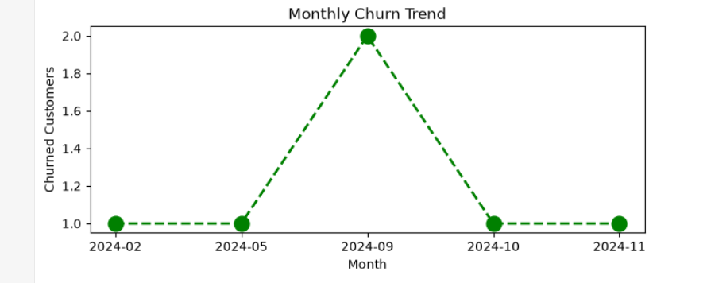
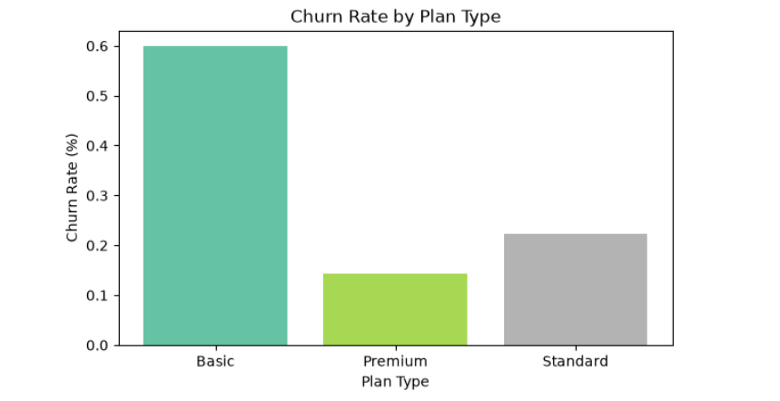
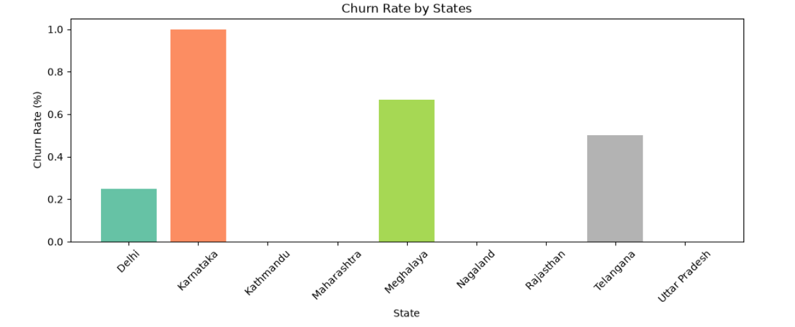
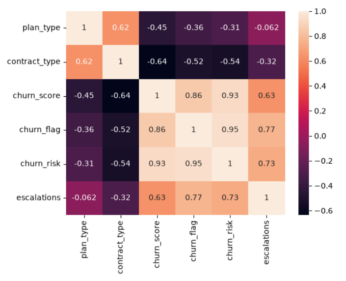

# Customer Churn Analysis

## 📊 Project Overview

This project analyzes customer churn using Python, Pandas, SQL/SQLite, Matplotlib, and Seaborn.

The objective is to understand customer churn patterns, identify factors associated with churn, and generate useful business insights from customer, subscription, and support data.

## 🎯 Project Objectives

* Calculate the overall customer churn rate
* Measure customer retention
* Analyze churn across different subscription plans
* Calculate Average Revenue Per User (ARPU)
* Analyze customer tenure
* Estimate monthly revenue at risk from churned customers
* Analyze customer complaints and escalations
* Examine the relationship between escalation and churn
* Create customer churn-risk categories
* Analyze churn trends using visualizations
* Compare churn across states, plans, and contract types
* Use pivot tables for business-oriented analysis

## 🗂️ Dataset

The project uses customer data stored in a SQLite database.

The database contains three main tables:

* `db_customer` — customer information
* `db_subscription` — subscription and churn information
* `db_support` — customer support information

The analysis combines these tables using `customerid`.

## 🛠️ Tools & Technologies

* Python
* Jupyter Notebook
* Pandas
* NumPy
* Matplotlib
* Seaborn
* SQLite
* SQL
* Data Cleaning
* Feature Engineering
* Exploratory Data Analysis (EDA)
* Data Visualization
* Pivot Tables

## 🔄 Project Workflow

### 1. Data Import

The customer, subscription, and support data are loaded from the SQLite database.

### 2. Data Cleaning

The project performs several cleaning steps, including:

* Renaming columns
* Removing unnecessary columns
* Converting date columns to datetime
* Standardizing gender values
* Handling missing country values
* Standardizing subscription and plan values
* Cleaning support data

### 3. Feature Engineering

A `churn_flag` is created based on whether a customer has a cancellation date.

Additional analytical features are used for:

* Customer tenure
* Complaint count
* Escalation information
* Customer churn risk

### 4. Data Analysis

The notebook calculates important business KPIs such as:

* Churn Rate
* Retention Rate
* Churn by Plan Type
* ARPU
* Average Customer Tenure
* Revenue at Risk
* Escalation Rate
* Average Complaints per User
* Churn Risk

### 5. Data Visualization

The project uses Matplotlib and Seaborn to visualize:

* Monthly churn trends

* Churn by plan

* Churn by state

* Correlations between variables

* Customer characteristics by churn risk

### 6. Pivot Table Analysis

Pivot tables are used to summarize customer churn and revenue-related metrics across different customer segments.

## 📈 Key Results

Based on the provided dataset:

* Total customers: **21**
* Churned customers: **6**
* Churn rate: **28.57%**
* Retention rate: **71.43%**
* ARPU: approximately **18.85**
* Monthly revenue at risk from churned customers: approximately **73.94**

The analysis also shows differences in churn across subscription plans and customer segments.

These results are descriptive findings from the supplied dataset and should not be interpreted as causal conclusions.

## 💡 Business Insights

The analysis can help a business:

* Identify customer segments with higher churn
* Monitor subscription plans with elevated churn
* Identify customers with higher churn-risk scores
* Understand the potential revenue exposure from churn
* Investigate the relationship between support escalations and churn
* Develop targeted customer-retention strategies

## 👤 Author

**Sahil Rawat**

Data Analytics Portfolio Project
